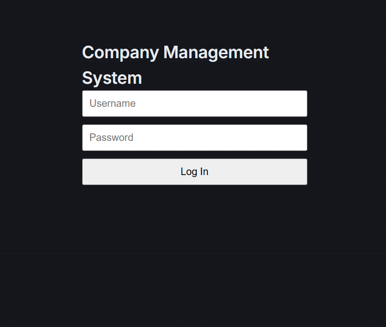
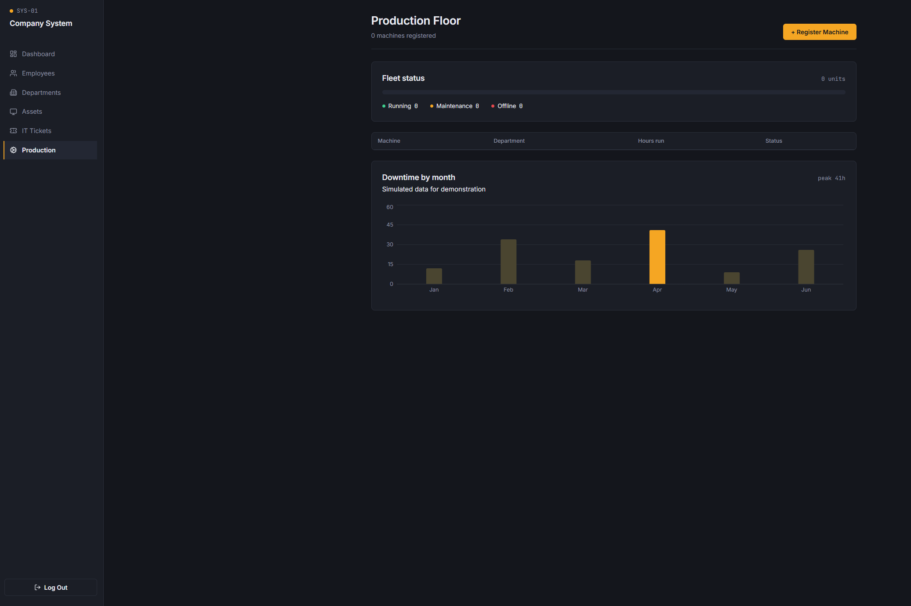
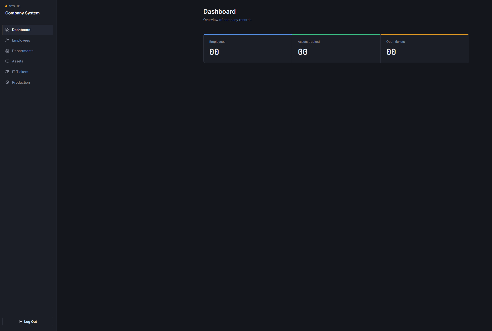

# NexusOps

A full-stack internal company management system for employee records, departments, IT asset tracking, support tickets, and a production floor dashboard, built with role-based authentication and containerized deployment.

## Overview

NexusOps simulates the kind of internal tool a company's IT team might build and maintain: a single system for managing employees, departments, equipment, and IT support requests, plus a lightweight view into production floor status for manufacturing environments.

## Screenshots

**Login**

**Dashboard**

**Departments**

## Tech Stack

| Layer | Technology |
|---|---|
| Frontend | React, TypeScript, React Router, Recharts |
| Backend | FastAPI (Python) |
| Database | PostgreSQL |
| Auth | JWT (JSON Web Tokens), role-based access control |
| Testing | Pytest |
| Containerization | Docker, Docker Compose |
| Web server | Nginx (serving the production frontend build) |

## Features

- **Authentication & roles**: JWT-based login with three roles (admin, it_staff, employee), each with different permissions
- **Employee management**: full CRUD, search, and department assignment
- **Department management**: admin-only management of company departments
- **Asset tracking**: IT equipment (laptops, monitors, etc.) with status tracking, restricted to admin/IT staff
- **IT support tickets**: employees can raise tickets; IT staff/admin can triage and update status; employees see only their own tickets
- **Production floor dashboard**: machine status tracking (running, maintenance, offline) with a fleet status overview and downtime visualization (uses clearly labeled synthetic data for demonstration)
- **Automated tests**: Pytest suite covering authentication, CRUD operations, and role-based permission enforcement

## Architecture

Browser connects to Nginx, which serves the React frontend and proxies API calls to FastAPI, which connects to PostgreSQL. Each layer runs in its own Docker container, orchestrated with Docker Compose.

## Running locally

Requirements: Docker and Docker Compose installed.

1. Clone the repo:

git clone https://github.com/Sadikn7i/NexusOps.git
cd NexusOps

2. Create a .env file in the project root with the following content:

POSTGRES_USER=postgres
POSTGRES_PASSWORD=your-password-here
POSTGRES_DB=company_db
DATABASE_URL=postgresql://postgres:your-password-here@db:5432/company_db

3. Start everything:

docker compose up --build

Frontend: http://localhost:5173
Backend API docs: http://localhost:8000/docs

On first run, create an admin user via the API docs (POST /api/users) before logging in through the frontend.

## Running tests

cd backend
pip install -r requirements.txt
pytest -v

## Project structure

NexusOps/
- backend/: FastAPI application, models, auth, tests
- frontend/: React + TypeScript application
- docker-compose.yml
- README.md

## Future improvements

- Refresh tokens and token expiry handling in the frontend
- Pagination for large employee/asset lists
- File uploads (e.g., employee photos, ticket attachments)
- CI/CD pipeline for automated testing on push

## Author

Sadik (Aden) [GitHub](https://github.com/Sadikn7i)

## License

This project is licensed under the MIT License.
